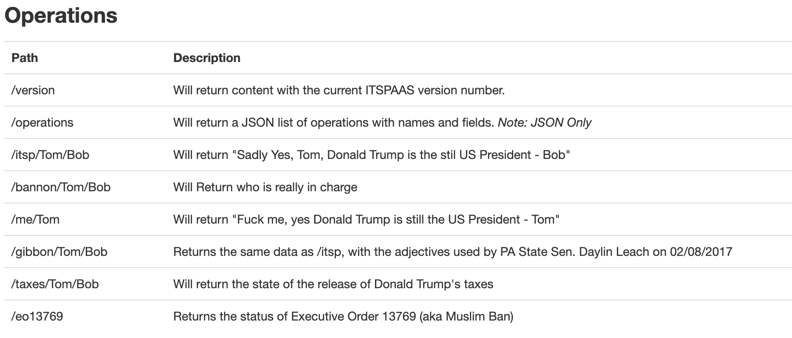

# __ITSPAAS__
## __Is Trump Still President (As A Service)__

For this project, I set out to create the most useless tool there is (useless for at least the majority of the population). The tool is called **Is Trump Still President and is Libya Still on the Travel Ban**. To most people, the information provided by this tool may not be of interest or use but to me it is of great value. Given that I'm from Libya and Executive Order 13769 (aka the Travel Ban) directly impacts me, I find myself often googeling updates about the state of Trump's presidency. So, as a way to curb that and in an effort to make knowing if he is still president a seamless process, I created the ITSPAAS tool.   

### The Apparatus
The tool consists of two physical structures:
- Sensor platform
- Ambient Display

For the sensor platform, I made a structure with googly eyes that houses a motion sensor, a push button, and an ESP. As for the ambient display, it is made out of a white box with three front windows. The windows are comprised of translucent material to defuse light. There is also an embedded speaker and an ESP.  

Here are some pictures of the circuits:

### How it Works
The motion sensor is placed on a front door table in my apartment so that every time I open the door or walk by it the sensor detects motion. When motion is detected, an API call is made to ITSPAAS, which provides a modern, RESTful, scalable solution to the common problem of checking if Donald Trump is still President of the US.

There is other data apart from the status of his presidency that can be obtained from the API, such as:

Data is received from the API in a JSON format, which in turn is published to an MQTT server. The ambient display is subscribed to the MQTT channel that publishes the relevant data. A checker function is implemented to see if Donald is still president. If he is, then the ambient display fades a group of red LEDs and plays a sound using the embedded speaker.

Here is an example of the data published on the MQTT server:

### Additional Information:
- Video Documentation of Ambient Display [here](https://youtu.be/EOsYNO67eMk)
- Documentation for the ITSPAAS API can be found [here](http://istrumpstillpresident.io/)
